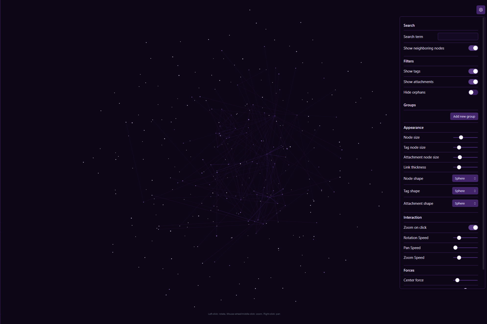

# 3D Graph for Obsidian

A plugin for Obsidian that provides a highly customizable 3D, force-directed graph view of your vault. This offers an alternative, immersive way to visualize and explore the connections between your notes.

*Check out my blog post [here](https://aryan-gupta.is-a.dev/blog/2025/3d-graph-plugin/)*

## Why Choose This 3D Graph?
While other 3D graph plugins exist, this one is built to offer the most **interactive and deeply customizable** experience for exploring your vault.

- **Unparalleled Customization**: Go beyond the basics with granular control over your graph's appearance and physics. Independently customize the shape, size, and color for notes, attachments, and tags. Fine-tune the physics simulation with live-updating sliders to get the exact layout you want.

- **A Truly Live Experience**: All settings—from colors and filters to physics—are applied instantly without needing to reload the view. This creates a fluid, interactive experience that lets you sculpt and analyze your graph in real-time.

- **Powerful Filtering and Coloring**: Visually organize your vault with powerful tools. Use `path:`, `tag:`, and `file:` queries to create color-coded groups, just like in Obsidian's native graph. A powerful search bar also helps you find specific notes and focus on their connections.

- **Modern & Maintained**: Built on a robust and performant tech stack, this plugin is actively maintained to ensure compatibility and introduce new features.

## Features

* **Interactive 3D Canvas:** Pan, zoom, and rotate around your notes to explore their relationships from any angle.

* **Node Interaction:**

	* **Single-click** on a node to focus the camera on it and highlight its immediate connections.

	* **Double-click** on a file or attachment node to open it in a new tab.

* **Advanced Filtering & Search:**

	* **Live Search:** A powerful search bar to find specific notes and their neighbors.

	* **Live Filters:** Toggle visibility for attachments, tags, and orphan nodes on the fly.

* **Deep Customization:**

	* **Color Groups:** Create rules to color-code your graph based on file paths (`path:`), tags (`tag:`), file names (`file:`), or content.

	* **Node Appearance:** Independently control the shape, size, and color for notes, attachments, and tags.

	* **Physics Engine:** Fine-tune the graph's layout with sliders for Center force, Repel force, and Link force.

* **Stable & Performant:**

	* All settings update the graph instantly without requiring a reload.
	* Intelligently caches node positions for a smooth experience when updating data.

## How to Install

1. Download `main.js`, `manifest.json`, and `styles.css` from the latest [release](https://github.com/Apoo711/obsidian-3d-graph/releases).

2. In Obsidian, open `Settings` > `Community plugins`.

3. Make sure "Restricted mode" is turned off.

4. Open your vault's plugin folder by clicking the small folder icon next to "Installed plugins".

5. Create a new folder named `new-3d-graph`.

6. Copy the downloaded `main.js`, `manifest.json`, and `styles.css` files into this new folder.

7. Go back to Obsidian's "Community plugins" settings and click the refresh button.

8. Enable "New 3D Graph".

Once enabled, you can open the 3D Graph from the ribbon icon on the left sidebar or by using the Command Palette (`Ctrl/Cmd + P` and typing "Open 3D Graph").

## Settings

You can configure the 3D Graph by going to `Settings` > `3D Graph Plugin`. All settings are applied live.

* **Search:** Filter the graph by a search term.

* **Filters:** Toggle visibility for `tags`, `attachments`, and `orphans`.

* **Color Groups:** Set custom colors for nodes using `path:`, `tag:`, and `file:` queries.

* **Display & Appearance:** Customize the shape, size, and color for every element in the graph.

* **Forces:** Adjust the physics simulation to change the graph's layout and feel.

## Future Plans

* **Performance Optimizations:**

	* Implement a "Local Graph" mode for massive vaults.

* **UX Enhancements:**

	* Add more advanced query types for groups and search.

## Acknowledgements

This plugin relies heavily on the fantastic [3d-force-graph](https://github.com/vasturiano/3d-force-graph) library for rendering and physics.

Built with ❤️ for the Obsidian community.
