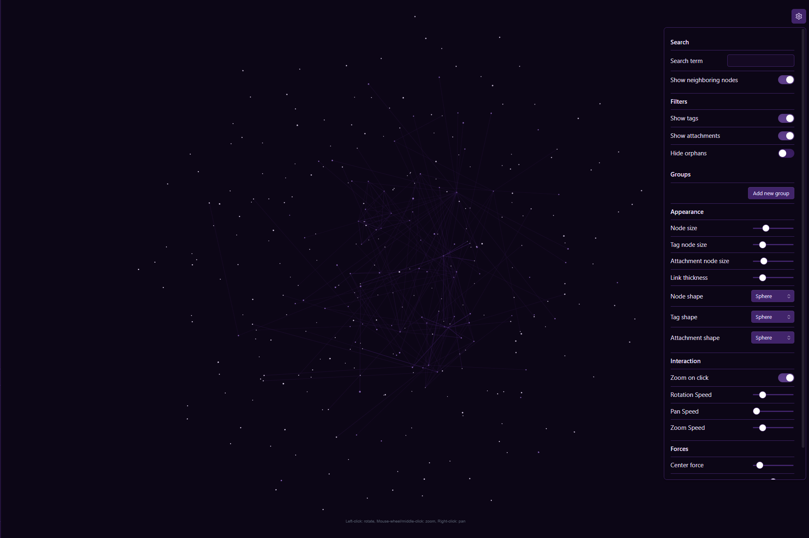

# 3D Graph for Obsidian

A plugin for Obsidian that provides a high-performance 3D, force-directed graph view of your vault. Powered by a custom **Rust + WebAssembly** physics engine with **128-bit SIMD** acceleration, it offers an immersive, fluid way to visualize and explore thousands of note connections.

---

💡 _Check out my blog post [here](https://aryan-gupta.is-a.dev/blog/2025-06-24-3d-graph-plugin/)_

---

## Why Choose This 3D Graph?

While other 3D graph plugins exist, this one is built for **extreme performance and deep customization**:

- **Blazing Fast Rust WASM Physics Engine**: Physics calculations are offloaded to a dedicated Web Worker running a **Rust WebAssembly engine with 128-bit SIMD intrinsics** and a **3D Barnes-Hut Octree ($O(N \log N)$)**. Handles 50,000+ nodes and edges effortlessly at 60+ FPS while keeping camera rotation buttery smooth.
- **Unparalleled Customization**: Granular control over your graph's appearance and physics. Independently customize shapes, sizes, and colors for notes, attachments, and tags. Fine-tune repulsion, attraction, gravity, and damping with live sliders.
- **Zero-Copy & Energy Efficient**: Zero-copy array buffer transfers eliminate GC pauses. Automatic kinetic energy cooling pauses physics calculations when the layout reaches equilibrium to save 100% CPU when idle.
- **Powerful Filtering & Coloring**: Visually organize your vault with `path:`, `tag:`, `file:`, and text queries to create custom color-coded groups, filter tags/attachments/orphans, and highlight neighbor connections.

---

## Key Features

- **Interactive 3D Canvas:** Pan, zoom, and rotate around your notes from any angle with responsive WASD keyboard controls.
- **Node Interaction:**
    - **Single-click** a node to focus the camera and highlight immediate links.
    - **Double-click** a node to open it in a new tab.
    - **Drag & Drop** nodes in 3D space to re-anchor layout positions live.
- **Rust WASM Physics Backend:**
    - Off-thread simulation tick loop running inside a Web Worker.
    - Instant parameter updates and zero-copy position synchronization.
- **Advanced Filtering & Search:**
    - **Live Search:** Instant query filtering for notes and neighboring connections.
    - **Live Filters:** On-the-fly toggles for attachments, tags, and orphan nodes.
- **Deep Customization:**
    - **Color Groups:** Rule-based styling with `path:`, `tag:`, `file:`, or content matching.
    - **Node Appearance:** Custom shapes (Sphere, Cube, Pyramid, Tetrahedron) and sizing.
    - **Physics Controls:** Tweak Center force, Repel force, Link force, and WASM engine mode.

---

## How to Install

### Recommended Method (Community Plugins)

1. Open **Settings > Community plugins**.
2. Turn **Restricted mode** OFF.
3. Click **Browse** and search for **"New 3D Graph"**.
4. Click **Install**, then **Enable**.

### Beta Installation (via BRAT)

1. Install the **BRAT** plugin from Community Plugins.
2. Open BRAT settings (`Settings` > `BRAT`).
3. Click **Add Beta plugin** and enter `Apoo711/obsidian-3d-graph`.
4. Enable **3D Graph** in Community Plugins.

Open the 3D Graph from the ribbon icon on the left sidebar or using the Command Palette (`Ctrl/Cmd + P` $\rightarrow$ _"Open 3D Graph"_).

---

## Settings Overview

Go to `Settings` > `3D Graph Plugin` or use the in-graph floating settings gear icon:

- **Search & Filters:** Search term matching, neighboring node inclusion, and tag/attachment/orphan toggles.
- **Color Groups:** Custom color assignment rules using `path:`, `tag:`, and `file:`.
- **Appearance & Display:** Custom geometry shapes, sizes, colors, and label visibility distance.
- **Interaction:** Keyboard navigation (WASD), zoom speed, pan speed, and rotation sensitivity.
- **Forces:** Adjust Repel force, Link force, Center force, and toggle **"Use Rust WASM Physics Engine"**.

---

## Acknowledgements

- **Rust & WebAssembly**: High-performance physics core using `glam` SIMD vector math, `wasm-bindgen`, and `wasm-opt`.
- **Three.js**: 3D scene rendering, lighting, and GPU instancing.
- Built with ❤️ for the Obsidian community.
